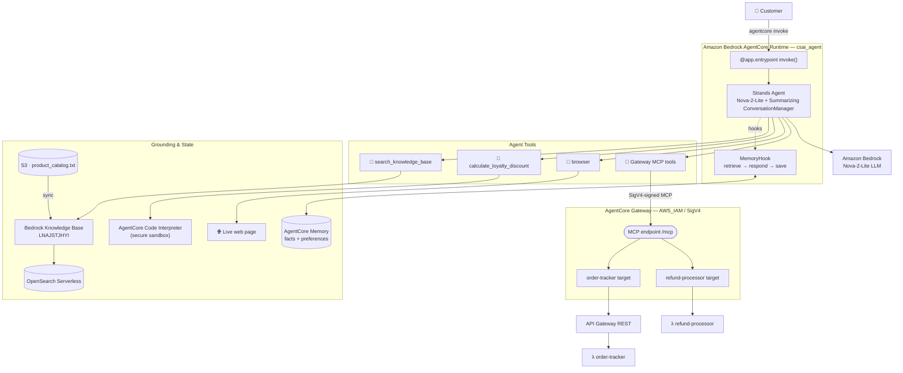
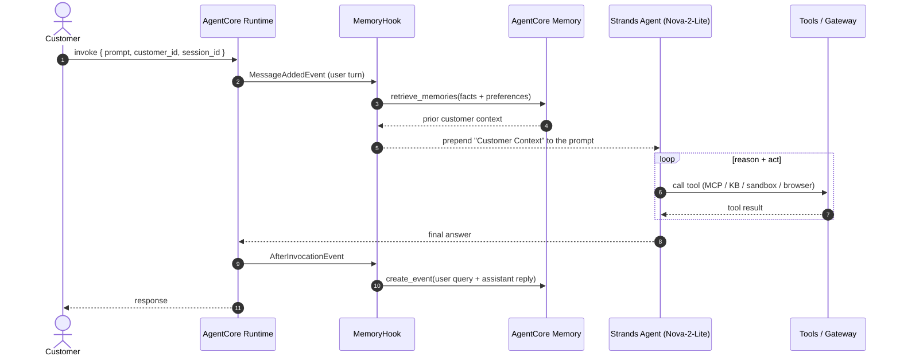
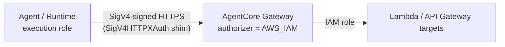

# 🛍️ Customer Support AI Agent

An intelligent, multi-capability customer-support agent for an e-commerce platform,
built on **Amazon Bedrock AgentCore** with the **Strands SDK** and deployed to
**AgentCore Runtime**. It handles order tracking, returns and refunds, product and
policy Q&A, cross-session memory, exact loyalty-discount math, and live web browsing
— all through a single conversational interface.

> **Model:** `global.amazon.nova-2-lite-v1:0` · **Region:** `us-east-1` · **Runtime:** `csai_agent`

---

## ✨ Capabilities

| Capability | How it works | Backing service |
|---|---|---|
| 📦 **Order tracking & customer lookup** | `order-tracker` tools over MCP | Lambda behind API Gateway, via AgentCore **Gateway** |
| 💸 **Refunds, status & return labels** | `refund-processor` tools over MCP | Lambda (direct) via AgentCore **Gateway** |
| 📚 **Product / policy Q&A (RAG)** | `search_knowledge_base` → Retrieve API | Bedrock **Knowledge Base** + OpenSearch Serverless |
| 🧠 **Cross-session memory** | `MemoryHook` retrieves before & saves after each turn | AgentCore **Memory** (semantic facts + preferences) |
| 🧮 **Exact loyalty discounts** | `calculate_loyalty_discount` runs sandboxed Python | AgentCore **Code Interpreter** |
| 🌐 **Live web browsing** | `browser` tool | AgentCore **Browser** |

---

## 🏗️ Architecture



---

## 🔁 Request lifecycle

Every `invoke` retrieves relevant memory, reasons with tools, then persists the turn:



---

## 🔐 Gateway authentication (design highlight)

The Gateway uses the **`AWS_IAM` authorizer** instead of the default Cognito OAuth
flow. Each MCP request is signed with **SigV4** using the caller's AWS identity — the
deployed runtime signs with its own execution role. No OAuth client secrets to store
or rotate.



Why this matters: the standard Cognito quick-start needs `cognito-idp:CreateResourceServer`
(unavailable in the lab account). `AWS_IAM` removes that dependency entirely and is
arguably more secure — see [REFLECTION.md](REFLECTION.md).

---

## 📂 Project structure

```
main.py                    # the agent — all 8 sections implemented
lambda/
  ├── order_tracker.py     # Lambda: order & customer lookup (behind API Gateway)
  ├── refund_processor.py  # Lambda: refunds, status, return labels (direct target)
  └── lambda_schema        # tool schema for the refund Gateway target
product_catalog.txt        # Knowledge Base source (uploaded to S3)
requirements.txt           # runtime container dependencies
.bedrock_agentcore.yaml    # AgentCore deployment config
images/                    # test screenshots (six scenarios)
screenshots/               # terminal-output logs for the six scenarios
TEST_RESULTS.md            # captured output of all six test scenarios
REFLECTION.md              # written reflection
```

---

## 🚀 Quickstart

**Install & run locally**
```bash
uv sync
uv run main.py '{"prompt": "Can you track order ORD-001?", "customer_id": "CUST-123", "session_id": "s1"}'
```

**Deploy to AgentCore Runtime**
```bash
agentcore configure --entrypoint main.py --name csai_agent \
  --execution-role <runtime-role-arn> --requirements-file requirements.txt \
  --s3 <deploy-bucket> --region us-east-1 --disable-otel --disable-memory
agentcore deploy
```

**Invoke the deployed agent**
```bash
agentcore invoke '{"prompt": "What are the benefits of the Platinum loyalty tier?", "customer_id": "CUST-123", "session_id": "t3"}'
```

---

## 🧪 Test scenarios

All six pass against the deployed runtime (evidence in [`images/`](images/) and
[TEST_RESULTS.md](TEST_RESULTS.md)):

| # | Scenario | Expected |
|---|---|---|
| 1 | Order tracking | Status SHIPPED, tracking `TRK987654321`, UPS |
| 2 | Refund | Refund ID, APPROVED, $139.99, 3–5 business days |
| 3 | Knowledge Base (RAG) | Same-day shipping, 15% discount, priority support |
| 4 | Long-term memory | New session recalls "Jane" + concise-response preference |
| 5 | Loyalty discount | $99.00 final, 4000 points redeemed, $51 saved |
| 6 | Browser | Retrieves a live page title |

---

## ⭐ Beyond the rubric

- **Structured output validation** — the discount tool validates its result (sandbox
  *and* fallback paths) against the `DiscountBreakdown` Pydantic model, catching
  malformed computations before they reach the customer.
- **Conversation summarization** — uses Strands' `SummarizingConversationManager` to
  summarize older turns instead of dropping them, preserving long-conversation context
  while bounding token cost.
- **Accurate refunds** — the system prompt directs the agent to look up the order price
  before refunding, so the refund amount is correct rather than defaulting to $0.

---

## ⚙️ Configuration (`main.py`)

| Variable | Value |
|---|---|
| `GATEWAY_URL` | `https://customersupportgateway-j1o6wwgb1e.gateway.bedrock-agentcore.us-east-1.amazonaws.com/mcp` |
| `KB_ID` | `LNAJSTJHYI` |
| `MEMORY_ID` | `CustomerSupportMemory-HUHjiQ57Zd` |
| `REGION` | `us-east-1` |

---

## 🧹 Cleanup

```bash
agentcore destroy                 # remove the runtime
# then delete: Gateway, Memory, Knowledge Base, OpenSearch collection,
# S3 buckets, API Gateway, and the two Lambda functions.
```
